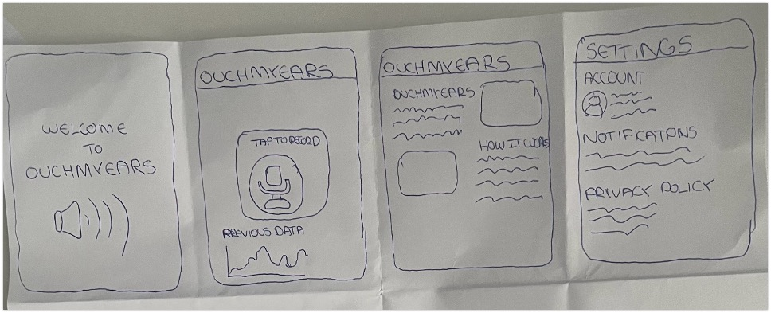
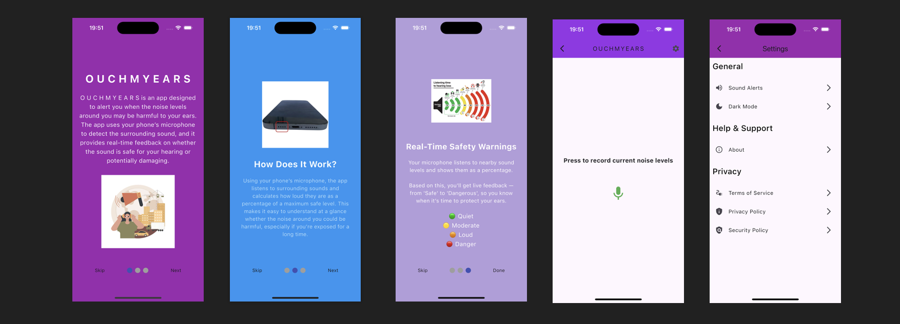

# O U C H M Y E A R S

Ouch My Ears is a lightweight mobile app built with Flutter that helps users visually understand the loudness of their environment using real-time microphone input. The app displays ambient noise levels through simple color indicators—green for safe, yellow for caution, and red for potentially harmful volumes making it ideal for students, commuters, and live music lovers who want to protect their hearing. Designed to be fast, intuitive, and privacy-friendly, the app requires no login or data collection, focusing solely on helping users stay aware of their auditory surroundings.

## Landing Page
https://em4n-0.github.io/ouchmyearslandingpage2/

## Initial Wireframes



## App Overview



## 📦 Flutter Dependencies Used
flutter

Core SDK for Flutter apps.

record 

permission_handler

flutter_svg 
 
smooth_page_indicator
  
settings_ui

shared_preferences


## Installation


```
git clone this repo

flutter pub get

flutter run (Use physical device, simulators don't have mics)

allow permission for mic usage when prompted

```


##  Contact Details
ucfneeg@ucl.ac.uk
